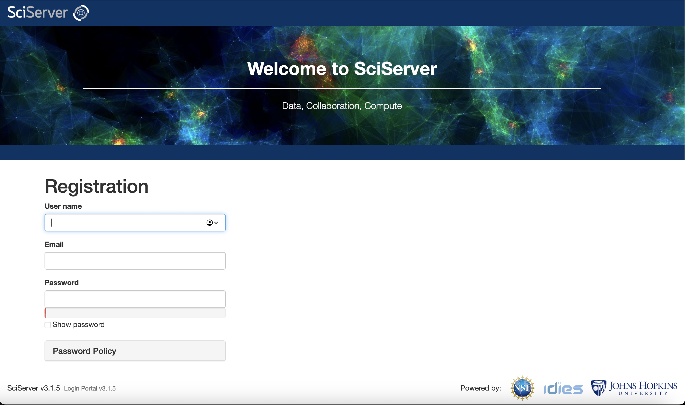
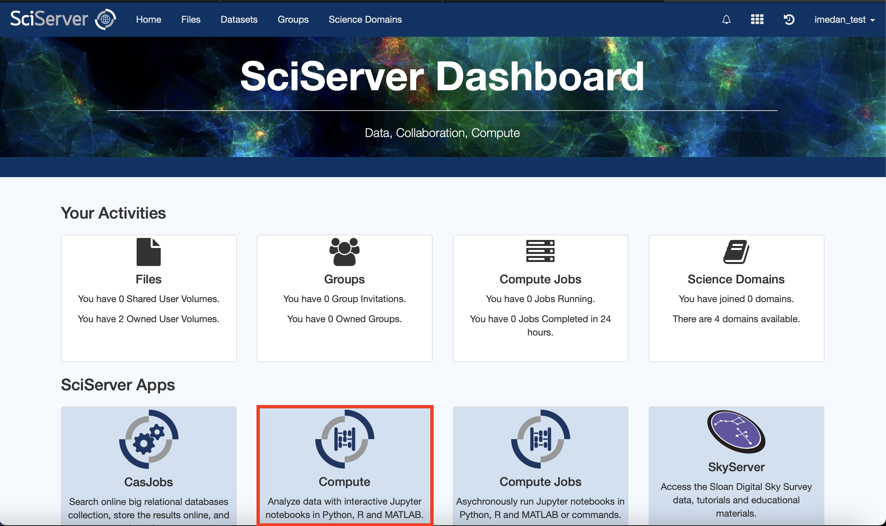
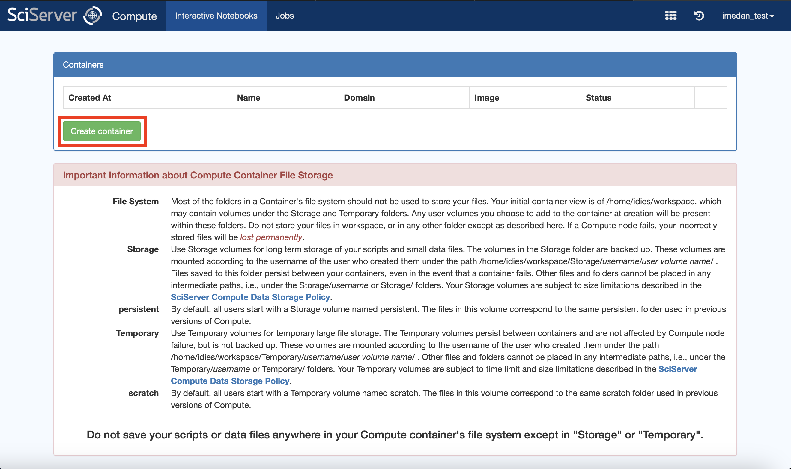
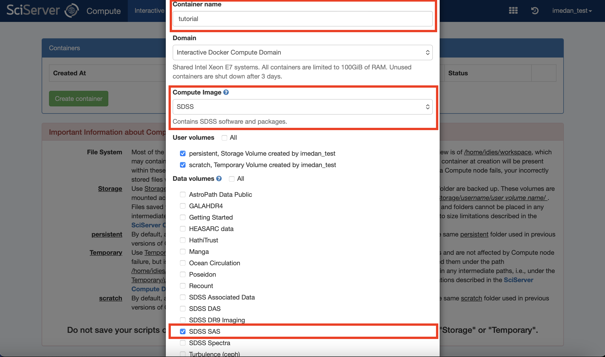

# SDSS-V Tutorials for NFC Workshop 2026

Included in this repository are two tutorials for the NFC Workshop (2026), which utilize the SDSS-V DR19 data. These include:

- [Metallicity Gradient of the Disk with APOGEE Results](https://github.com/imedan/nfc_sdss5/blob/main/tutorials/metallicity_gradient_w_APOGEE.ipynb)
- [Working with VACs: BOSS-MINESweeper and the Outer Halo](https://github.com/imedan/nfc_sdss5/blob/main/tutorials/distant_halo_w_BOSS.ipynb)

These tutorials are designed to be run on [SciServer](https://www.sciserver.org/). Below I will show how to create an account, and set up the container and environment to run these tutorials.

## SciServer Account

First, register for a SciServer account at this link: <https://apps.sciserver.org/login-portal/register?callbackUrl=https://apps.sciserver.org/dashboard/>. This will take you to this page:

Fill out your username, email and password. You will be sent an email to verify your account. Go to your email, click the verification link and this will allow you to login!

## Setting up a Container

When you first login, you will now be on the SciServer Dashboard:

To start a "container", which allows you to run e.g. Jupyter Notebooks on the SciServer computer, click "Computer" under "SciServer Apps" in the above (indicated by the red square). This will open this page:

To open a new container, click the "Create Container" button (indicated by the red square). This will open a dialogue box like:

Here, give the container a name, make sure to set the Compute Image to "SDSS" and include the Data Volume "SDSS SAS". Once these options are selected, create your container:

Click on your container name, which will open it and allow you to work on the tutorials!